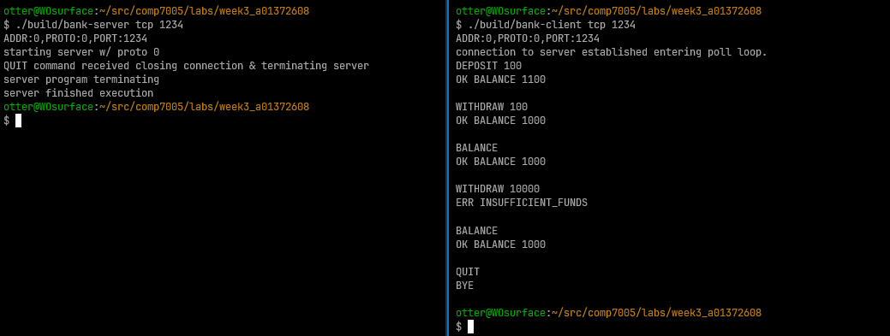
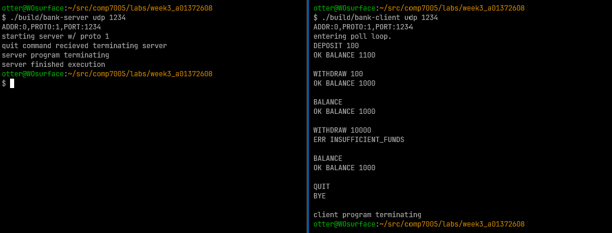

# COMP7005 Week3 Lab Report
Will Otterbein, A01372608

## Summary

This report describes my implementation of the week3 bank server lab.

## Obtaining a Program Binary

This section describes how to compile the project.

## Implementation

### TCP Client

### TCP Server

### UDP Client

### UDP Server

## Test Results

Here are the test results w/ the TCP & UDP versions of the program.

Results of TCP tests:

Results of UDP tests:

